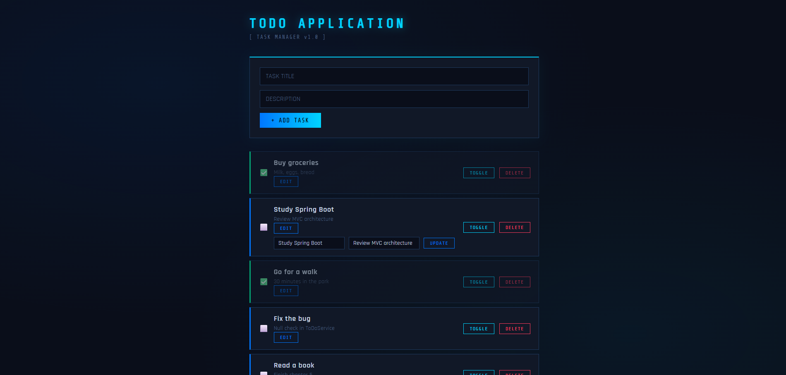

# ToDo Web Application

## Overview
This is a web-based ToDo application built with Spring Boot.

## Features
- View all current tasks
- Add new tasks with title and description
- Delete tasks
- Edit task
- Toggle task status between completed and not completed
- Data persistence using H2 database

## Screenshot


## Requirements
- Java 21

## How to Run
```bash
.\mvnw.cmd spring-boot:run
```
Access the app at `http://localhost:8080`

## What I learned
- **Spring Boot**: Setting up a web application with Spring Boot including Controllers, Services, and Repositories.
- **MVC Architecture**: Separating responsibilities between Controller, Service, and Entity layers.
- **Thymeleaf**: Building dynamic HTML pages connected to backend data.
- **JPA / H2 Database**: Persisting data using Spring Data JPA with H2 database.
- **CSS**: Styling a web application with a dark theme using CSS variables.